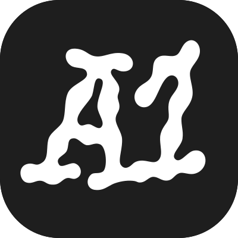

<div align="center">
  
  <h1>A1 Gallery MCP server</h1>
  <p><strong>Curated design references, inside your AI agent.</strong></p>
  <p>
    <a href="https://www.a1.gallery/mcp">Docs</a> ·
    <a href="https://www.a1.gallery">Gallery</a> ·
    <a href="https://www.a1.gallery/privacy">Privacy</a>
  </p>
</div>

---

A1 is a hand-picked gallery of real website designs. This MCP server puts it inside your
coding agent, so you can ask for a reference and get structured JSON back instead of
pasting screenshots and describing what you want.

Every site is captured at full length, split into its interior pages and its individual
sections, then measured. You get the type sizes, spacing, radius, container width and
palette taken off the rendered page — not guessed from a picture.

**In the gallery right now:** 1,165 sites · 3,209 captured sections · 2,860 full-page captures ·
571 fonts · 517 designers and studios.

## Endpoint

| | |
|---|---|
| **URL** | `https://www.a1.gallery/api/mcp` |
| **Transport** | Streamable HTTP |
| **Auth** | OAuth 2.1 with PKCE, dynamic client registration |
| **Registry name** | `gallery.a1/a1-gallery` |
| **Tools** | 17, all read-only |

Access is free with an A1 account — 50 tool calls a day. [A1 Pro](https://www.a1.gallery/pricing)
raises that to 2,000 a day with a higher per-minute allowance.

## Install

Your client opens a browser to sign in the first time it connects. Per-client
instructions with one-click install links are at [a1.gallery/mcp](https://www.a1.gallery/mcp).

### Claude Code — plugin

The plugin in this repository bundles the server with three skills, three slash commands
and a research sub-agent. It teaches the agent how to use the gallery, which the bare
connector does not.

```bash
claude plugin marketplace add bryntay/a1-mcp
claude plugin install a1-gallery
```

Then run `/mcp` and authenticate. See [Plugin](#plugin) below for what it adds.

### Claude Code — connector only

```bash
claude mcp add --transport http a1 --scope user https://www.a1.gallery/api/mcp
```

Then run `/mcp` and sign in when it prompts.

### Codex CLI

```bash
codex mcp add a1 --url https://www.a1.gallery/api/mcp
```

### Cursor and Claude Desktop

```json
{
  "mcpServers": {
    "a1": {
      "url": "https://www.a1.gallery/api/mcp"
    }
  }
}
```

### VS Code (1.99+ with GitHub Copilot)

```json
{
  "servers": {
    "a1": {
      "type": "http",
      "url": "https://www.a1.gallery/api/mcp"
    }
  }
}
```

### Windsurf

```json
{
  "mcpServers": {
    "a1": {
      "serverUrl": "https://www.a1.gallery/api/mcp"
    }
  }
}
```

### Zed (0.168+)

```json
{
  "context_servers": {
    "a1": {
      "url": "https://www.a1.gallery/api/mcp"
    }
  }
}
```

## What you can ask for

- *"Find three brutalist law firm sites and show me their heroes."*
- *"What type scale do agency heroes actually use?"* — quartiles across every site, not one example.
- *"Show me pricing pages that mention usage-based billing."* — full-text search inside the page copy.
- *"What do portfolio FAQs say about refunds?"* — extracted Q&A pairs with frequencies.
- *"Rebuild this pricing section."* — palette, type, spacing and radius as measured values.

## Tools

All 17 tools are read-only and annotated `readOnlyHint: true`.

### Websites

| Tool | What it does |
|---|---|
| `search_websites` | Keyword search across names, descriptions and taxonomy. Resolves aliases — "SaaS", "fintech", "brutalist" map to real taxonomy terms. |
| `browse_websites` | Filter-only browsing by type, category, style, technology or colour. |
| `get_website` | Everything for one site: fonts, colours, styles, technologies, creator, sections. |
| `get_similar_websites` | Inspiration clusters around a given site. |
| `get_recently_added` | Newest additions, publish-date descending. |
| `get_design_filters` | The full taxonomy with counts — use it to build valid filters. |

### Sections

| Tool | What it does |
|---|---|
| `search_sections` | Search inside section copy — headings, FAQ answers, pricing text, testimonials. Returns the screenshot, the extracted structure and the measured tokens. |
| `get_website_sections` | Every captured section for one site, in page order. |
| `analyze_section_content` | Aggregate content patterns across many sections — topic distribution, most common verbatim FAQ questions. |
| `analyze_design_tokens` | Aggregate measured values — p25/median/p75 for heading size, body size, scale ratio, padding, container width, radius, plus common typefaces and accent colours. |

### Pages

| Tool | What it does |
|---|---|
| `search_pages` | One page type across the whole gallery — every pricing page, every about page. Full-text searchable. |
| `get_website_pages` | The sub-pages captured for one site. |

### Fonts and creators

| Tool | What it does |
|---|---|
| `browse_fonts` | Fonts by classification, licence, or the category of site using them. |
| `get_font` | One font — classification, licence, description, usage count. |
| `find_font_pairings` | Real-world examples of two fonts used together. |
| `browse_creators` | Designers and studios, filterable by category or style. |
| `get_creator` | One creator: bio, links, featured work. |

Full descriptions, parameters and response shapes come back from `tools/list`.

## Plugin

Installing the connector gives an agent 17 tools. It does not tell the agent that
`analyze_design_tokens` answers "how big should this be" better than five screenshots, or
that a `lowSample` flag means stop generalising. The plugin carries that.

### Skills

| Skill | Fires when |
|---|---|
| `design-reference` | A design question needs evidence — type scale, spacing, palette, or what sites of a kind actually do. Routes to the aggregate tools first, examples second. |
| `section-rebuild` | Recreating a hero, pricing table or FAQ. Builds from the measured `designTokens` rather than reading values off the screenshot. |
| `setup` | First connection, or a `401 account_required`. Walks through OAuth and the quotas. |

### Commands

| Command | What it does |
|---|---|
| `/a1-gallery:reference` | Real sites matching a design brief, rephrased into the gallery's taxonomy. |
| `/a1-gallery:tokens` | Measured values for a section type, reported as p25–p75 ranges. |
| `/a1-gallery:pairings` | Sites using a font or a font pairing. |

### Sub-agent

`design-researcher` handles open briefs that need several searches — an aggregate pass,
a couple of targeted searches, then the values to build with. It returns a brief and never
edits files.

## Why aggregates use quartiles

`analyze_design_tokens` reports p25, median and p75 rather than an average. Design values
are long-tailed — one site with a 180px hero heading drags the mean somewhere useless.

Narrow slices thin out fast. Ask for pricing sections on shops and you may be looking at a
handful of examples. When that happens the response carries `lowSample: true` and reports
raw counts instead of percentages, so the agent can say "here are four examples" rather
than inventing a norm.

## Notes

Site descriptions and section copy are third-party website content. The tool descriptions
flag them as untrusted external data.

This repository holds the manifest and the docs. The server itself is closed-source and
hosted at a1.gallery.

## Support

Issues and questions: [open an issue](https://github.com/bryntay/a1-mcp/issues) or email
hello@a1.gallery.
